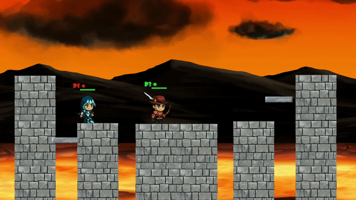
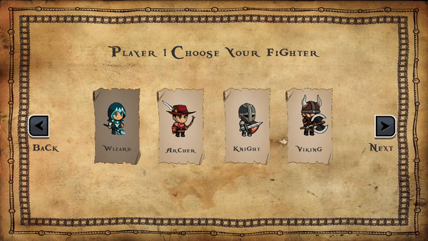

# Little Smash Men
A project created for Georgia Gwinnett College's STEC 4800 service learning course and the school's [Technology Ambassadors Program](https://www.ggc.edu/academics/schools/school-of-science-and-technology/research-internships-service-learning/technology-ambassador-program/). The program encourages students to create projects using science and technology as a way to reach members of the public - especially youth - and raise interest in STEM. This demo was created in Unity and is inspired by the popular "Super Smash Bros" game on Nintendo and leveraged the popularity of the game and genre to encourage interest in programming.

## Showcasing movement and some combat

Note: this was just me fiddling with three controllers trying to produce some semi-realistic gameplay for a gif.

## Showcasing some combat and animations

## Character selection menu

The demo is available for download in the Windows store (controllers are recommended): https://www.microsoft.com/store/productId/9NM9XM6DPQ2S

